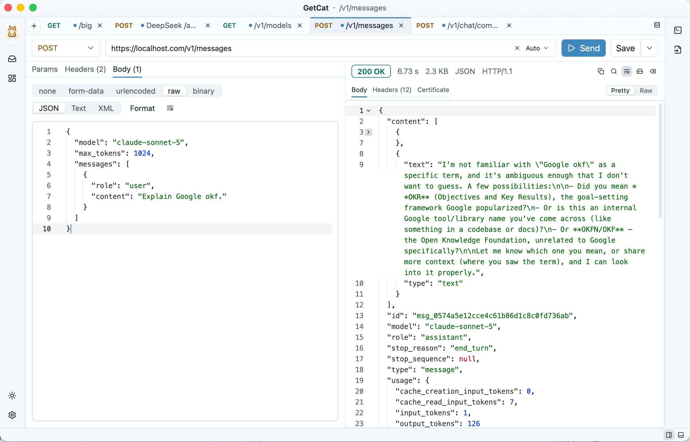

<div align="right">
<a href="README.md">简体中文</a> · <a href="README.en.md">English</a> · <b>日本語</b>
</div>

<div align="center">


# Germal

**Rust + [GPUI](https://gpui.rs) 製のネイティブ・クロスプラットフォーム HTTP API クライアント**

No Postman, Just Germal!

GPU レンダリング · 低リソース · アカウント不要 · データは完全ローカル · No Electron, No Tauri, No WebView

[](LICENSE)
[](https://www.rust-lang.org)
[](https://gpui.rs)
[](https://github.com/nermalcat69/germal/releases)
[](https://github.com/nermalcat69/germal/releases)
[](https://github.com/nermalcat69/germal/releases)



</div>

> **Germal は [GetCat](https://github.com/finch-xu/GetCat) のフォーク**です（作者 finch-xu、Apache-2.0 ライセンス）。GetCat の機能はそのまま、以下の「Germal の追加機能」が加わっています。

## Germal の追加機能

- **負荷テスト**：リクエスト（現在のタブまたは録画したもの）を選び、URL とメソッドを編集して、指定した並列数で N 回送信。専用ページに進捗、失敗数、ステータスコード、レイテンシのパーセンタイル、経過時間、対象ホストの IPv4 / IPv6 アドレス・ホスティング事業者（ASN）・DNS サーバーをリアルタイム表示します。
- **レコーダー**：Chromium ウィンドウを開き、閲覧した各ページの API（xhr / fetch）リクエストをローカルの SQLite に記録します（Authorization と Cookie を含むヘッダー、ボディ、タイミング、接続・TLS の詳細）。リクエストはプロジェクト別、さらにドメイン／サブドメイン別に整理され、GET / POST / その他で絞り込めます。右クリックで cURL としてコピー、または負荷テストへ送れます。
- **`.germal` ファイル**：`germal-rec export` は録画データベースを zstd で圧縮してから AES-256-GCM（パスフレーズから Argon2id で鍵導出）で暗号化し、1 つの `.germal` ファイルにします。`germal-rec unpack` で復元します。

## ハイライト

- **ネイティブで軽快**：GPU でレンダリングするネイティブウィンドウで、Electron / Tauri / WebView ではありません。macOS・Linux・Windows で同じ UI が動きます。
- **大きなレスポンスでも固まらない**：ストリーミング受信、リアルタイムの進捗表示、いつでもキャンセル可能。5 MB まではハイライト付きエディタ、64 MB までは行単位で仮想化（ドラッグ選択も ⌘C でのコピーもできます）、それより大きいものはディスクに退避してプレビュー＋ワンクリック保存。数百 MB のレスポンスでも UI は止まりません。レスポンスボディもヘッダーもワンクリックでコピーできます。
- **リクエストを隅々まで組み立てられる**：GET / POST / PUT / PATCH / DELETE / HEAD / OPTIONS、Path パラメータ（URL 内の `{name}`）、Query、Headers。Body は form-data（テキスト / ファイルフィールド、ファイルは長さを確定させたストリーミングアップロード）、x-www-form-urlencoded、raw JSON / Text / XML、バイナリファイル丸ごとのアップロードに対応。
- **LLM のストリーミングデバッグ**：SSE（text/event-stream）のレスポンスは届いた端から表示され、ストリームの終了を待つ必要がありません。OpenAI Chat Completions / Responses と Anthropic Messages のストリーム形式を自動で判別し、イベント一覧 / 結合済みテキスト / 生データの 3 つのビューに加えて、TTFT・イベント数・トークン使用量・生成速度の統計を表示します。サイドバーには 3 種類の API のリクエストテンプレート（プレーンテキスト / 画像付き / ストリーミング）と、MCP の新旧 2 世代のプロトコル用テンプレートが入っています。
- **コマンドを出し入れできる**：右側のレールで現在のリクエストを cURL / Python のコードに変換でき、逆に curl コマンドを貼り付けてインポートすることもできます。ブラウザの「cURL としてコピー」の出力はそのまま使え、取り込めなかったオプションは正直に一覧表示されます。
- **変数と前後処理**：グローバル / カテゴリ / 環境の三層変数、`{{var}}` と `{{$timestamp}}` の展開に対応します。送信前の変数設定、レスポンスからの抽出と検証をスクリプトなしで行え、Postman environment のインポート / エクスポートもでき、秘密の変数は画面上でマスク表示されます。
- **データはあなたのもの**：履歴もレスポンスも保存せず、どこにもアップロードしません。保存したリクエスト・下書き・設定は、手で編集でき Git で管理できる整形済み JSON ファイルです。
- **テーマと言語はシステムに追従**。ライト / ダーク、English / 中国語 / 日本語に固定することもできます。タイトルバーは自前で描画しているので、3 つのプラットフォームで見た目が揃います。
- **アクセシビリティ**：すべてのコントロールにアクセシブルな名前が付いており、スクリーンリーダーで操作できます。

## インストール

リリースが公開されると、パッケージは GitHub Releases に添付されます。

お使いのプラットフォーム向けのパッケージをダウンロードしてください [GitHub Releases](https://github.com/nermalcat69/germal/releases)

<table>
  <thead>
    <tr><th>プラットフォーム</th><th>ファイル</th><th>ダウンロード</th><th>備考</th></tr>
  </thead>
  <tbody>
    <tr><td>macOS（Apple Silicon）</td><td><code>Germal-macos-arm64.dmg</code></td><td><a href="https://github.com/nermalcat69/germal/releases/latest/download/Germal-macos-arm64.dmg">ダウンロード</a></td><td rowspan="2">署名・公証済み。「アプリケーション」にドラッグするだけ</td></tr>
    <tr><td>macOS（Intel）</td><td><code>Germal-macos-x64.dmg</code></td><td><a href="https://github.com/nermalcat69/germal/releases/latest/download/Germal-macos-x64.dmg">ダウンロード</a></td></tr>
    <tr><td>Linux（x64）</td><td><code>Germal-linux-x64.tar.gz</code></td><td><a href="https://github.com/nermalcat69/germal/releases/latest/download/Germal-linux-x64.tar.gz">ダウンロード</a></td><td rowspan="2">展開すると <code>germal</code> が出てきます。動作要件は下記</td></tr>
    <tr><td>Linux（arm64）</td><td><code>Germal-linux-arm64.tar.gz</code></td><td><a href="https://github.com/nermalcat69/germal/releases/latest/download/Germal-linux-arm64.tar.gz">ダウンロード</a></td></tr>
    <tr><td>Windows（ポータブル版、x64） <strong>推奨</strong></td><td><code>Germal-windows-x64.exe</code></td><td><a href="https://github.com/nermalcat69/germal/releases/latest/download/Germal-windows-x64.exe">ダウンロード</a></td><td rowspan="2">単一ファイル。どこに置いても動きます。動作要件は下記</td></tr>
    <tr><td>Windows（ポータブル版、arm64） <strong>推奨</strong></td><td><code>Germal-windows-arm64.exe</code></td><td><a href="https://github.com/nermalcat69/germal/releases/latest/download/Germal-windows-arm64.exe">ダウンロード</a></td></tr>
    <tr><td>Windows（インストーラー版、x64）</td><td><code>Germal-windows-x64.msi</code></td><td><a href="https://github.com/nermalcat69/germal/releases/latest/download/Germal-windows-x64.msi">ダウンロード</a></td><td rowspan="2">ユーザー単位にインストール、管理者権限は不要。スタートメニューから起動できます</td></tr>
    <tr><td>Windows（インストーラー版、arm64）</td><td><code>Germal-windows-arm64.msi</code></td><td><a href="https://github.com/nermalcat69/germal/releases/latest/download/Germal-windows-arm64.msi">ダウンロード</a></td></tr>
  </tbody>
</table>

<details>
<summary>対応する Linux ディストリビューション</summary>

2022 年以降の主要なデスクトップディストリビューションで動きます：**Ubuntu 22.04+**、**Debian 12+**、**Fedora 36+**、**Linux Mint 21+**、**openSUSE Leap 15.6+**、および Arch や openSUSE Tumbleweed などのローリングリリース。これらのグラフィックスドライバーは最初から動くので、追加でインストールするものはありません。

これより古いリリースでは動きません：Ubuntu 20.04、Debian 11、RHEL / Rocky / AlmaLinux 9 はいずれも glibc 2.35 という下限を下回っています。

展開して `./germal` を実行するだけで動きます。アプリ一覧（Ubuntu の「アプリケーションを表示」）や Dock に出したい場合は、**設定 → 一般 → アプリケーションメニューに追加** をオンにしてください。Germal がランチャーとアイコンを `~/.local/share` 以下に書き込み、以後は Super キーで検索して起動でき、右クリックの「お気に入りに追加」で Dock に固定できます。オフにすると削除されます。Wayland ではウィンドウと Dock のアイコンもこのランチャーから取られるため、オンにしていないと汎用アイコンが表示されます。

ランチャーは現在の実行ファイルを指すので、先に `germal` を固定の場所へ置いてからオンにしてください。例：

```bash
tar -xzf Germal-linux-x64.tar.gz
install -Dm755 germal ~/.local/bin/germal
~/.local/bin/germal
```

あとでファイルを移動した場合は、スイッチを一度オフにしてからオンにし直すとパスが更新されます。

</details>

<details>
<summary>Linux で起動後に画面が真っ黒になる、または Vulkan / GPU が見つからないエラーが出る</summary>

UI は Vulkan 経由で GPU がレンダリングしています。デスクトップ向けディストリビューションには通常ドライバーが入っているので、まず確認してください：

```bash
vulkaninfo --summary
```

何も出力されない、またはデバイスが見つからないと表示される場合は、GPU に合わせてドライバーをインストールします：

| 環境 | コマンド |
|---|---|
| Ubuntu / Debian ＋ Intel・AMD の GPU | `sudo apt install mesa-vulkan-drivers` |
| Fedora ＋ Intel・AMD の GPU | `sudo dnf install mesa-vulkan-drivers` |
| Arch ＋ Intel・AMD の GPU | `sudo pacman -S vulkan-intel` または `vulkan-radeon` |
| NVIDIA の GPU | プロプライエタリドライバー（例：`nvidia-driver-550`）を入れてください。オープンソースの nouveau は Vulkan に対応していません |
| 仮想マシン / GPU なし | `mesa-vulkan-drivers` を入れると lavapipe のソフトウェアレンダリングにフォールバックします。動きますが遅いです |

</details>

<details>
<summary>対応する Windows のバージョン</summary>

**Windows 10 1803（2018 年 4 月更新）以降**、または Windows 11 が必要です。UI は Direct3D 11 でレンダリングするため、2010 年前後のグラフィックスハードウェアがあれば十分で（feature level 10.1 以上）、DirectX 12 は必要ありません。

どちらのビルドでも使えますが、ポータブル版をおすすめします（Snapdragon 搭載ノートなどの ARM デバイスでは `-arm64` のパッケージを選んでください）：

- **`Germal-windows-<arch>.exe`（ポータブル版、推奨）**：単一ファイル。USB メモリでも任意のディレクトリでも、置いてダブルクリックするだけです。レジストリには何も書きません。
- **`Germal-windows-<arch>.msi`（インストーラー版）**：`%LOCALAPPDATA%\Programs\Germal` にインストールします。管理者権限は不要で、スタートメニューに Germal が追加され、「アプリと機能」からアンインストールできます。

アプリ内アップデートはどちらにも対応しています。MSI でインストールした場合は新しい MSI を取得してサイレントにアップグレードし、ポータブル版は自分の exe を置き換えます。

どちらもまだコード署名をしていないため、初回起動時に SmartScreen に止められます。ポータブル版の exe は「詳細情報」→「実行」、MSI はインストーラーなので警告がより目立ちますが、同じ手順で先に進めます。

</details>

## 使い方

1. メソッドを選び、URL を入力して **⌘ Enter**（Windows / Linux は Ctrl Enter）で送信します。
2. Params / Headers / Body タブでパラメータを入力します。URL 内の `{name}` は Path パラメータの表に自動で現れます。
3. レスポンス欄でステータス / 所要時間 / サイズを確認し、Pretty / Raw を切り替え、**⌘ F** でレスポンス内を検索したり、ファイルに保存したりできます。
4. **⌘ S** でリクエストをサイドバーに保存すると、あとからクリックして呼び出せます。保存したリクエストは 1 階層のカテゴリに対応しており、保存時にカテゴリを選ぶか新規作成すると、サイドバーでカテゴリごとに閲覧できます。

| 操作 | macOS | Windows / Linux |
|---|---|---|
| 送信 | ⌘ Enter | Ctrl Enter |
| 新しいタブ / タブを閉じる | ⌘ T / ⌘ W | Ctrl T / Ctrl W |
| サイドバーを折りたたむ | ⌘ B | Ctrl B |
| リクエストを保存 | ⌘ S | Ctrl S |
| レスポンス内を検索 | ⌘ F | Ctrl F |
| 設定 | ⌘ , | Ctrl , |

設定では、UI の言語（システムに追従 / English / 中国語 / 日本語）、リクエストのタイムアウト、リダイレクト、TLS 検証、エディタのフォントサイズ、起動時にアップデートを確認するかどうかを変更できます。

### データディレクトリ

| プラットフォーム | ディレクトリ |
|---|---|
| macOS | `~/Library/Application Support/Germal/` |
| Linux | `$XDG_DATA_HOME/germal/`（既定は `~/.local/share/germal/`） |
| Windows | `%APPDATA%\Germal\data\` |

```
workspace.json          # タブの順序、サイドバー、分割方向、テーマの設定
requests/<ulid>.json    # 保存したリクエスト 1 件につき 1 ファイル
drafts/<tab-id>.json    # タブ 1 つにつき下書き 1 ファイル
settings.json           # アプリケーションの設定
```

書き込みはアトミック（一時ファイル → 置き換え）なので、クラッシュしても中途半端なファイルは残りません。パースに失敗したファイルは `.corrupt-<タイムスタンプ>` にリネームしてスキップします。`Authorization` などのヘッダーは平文で保存され（Postman や Insomnia のローカルストアと同じです）、Unix ではファイルのパーミッションは 0600 です。

## 開発

### アーキテクチャ

```
crates/
├─ germal-core   # UI に依存しないコア：リクエストモデル、送信（reqwest + tokio）、大きなレスポンスの段階分けとディスクへの退避、JSON ファイルストレージ
└─ germal-app    # GPUI の UI：Workspace / RequestTab の状態、設定ダイアログ、アプリ内アップデート
```

- UI は Zed の [gpui](https://github.com/zed-industries/zed/tree/main/crates/gpui) と [GPUI Kit](https://github.com/longbridge/gpui-kit)（gpui-component のコンポーネントライブラリ）で作られています。Kit 0.6 の公式な形に従い、アプリが依存するのは crates.io の `gpui-kit` 1 つだけで、対応する gpui のバージョンはそこで固定されます。
- 通信は tokio ランタイム上で動き、結果はチャネル経由で GPUI のメインスレッドへ戻ります。バックグラウンド処理（整形・インデックス作成）は `catch_unwind` で包んであるため、panic は「バックグラウンド処理エラー」として表示されるだけです。
- データベースはありません。`germal-core/src/store` が読み書きを担当し、書き込みは専用スレッドで 500 ms 分をまとめて行います。

### ビルドとデバッグ

- Rust ≥ 1.97（edition 2024）。macOS では追加のツールチェーンは不要です。Linux では Vulkan と Wayland / X11 / fontconfig のヘッダーが必要です（一覧は `.github/workflows/ci.yml`）。Windows では MSVC ツールチェーンが必要で、Direct3D 11 は Windows SDK に含まれています。
- アプリのロゴ：`crates/germal-app/assets/logo/cat.png` が背景を抜いた元画像で、`scripts/gen-logo.py` がそこから 3 つの成果物 —— アプリに埋め込む `germal.png`、macOS のアイコン元画像 `resources/macos/germal-1024.png`、Windows の exe アイコン `resources/windows/germal.ico` —— を生成します。ロゴを変更したら手動でスクリプトを再実行し、成果物をコミットしてください（CI では生成しません。`pip install pillow numpy` が必要です）。
- Windows の exe アイコンとバージョン情報は `crates/germal-app/build.rs` が埋め込みますが、有効なのは Windows 上でネイティブにコンパイルしたときだけです（macOS からクロスコンパイルした exe にアイコンは付きません）。インストーラーは `crates/germal-app/resources/windows/Germal.wxs` で定義されており、WiX v6 が必要です：`dotnet tool install --global wix --version 6.*`。

```bash
cargo run -p germal-app                         # 実行
cargo test --workspace                          # ユニット + wiremock + gpui TestAppContext のテスト
RUST_LOG=debug cargo run -p germal-app          # ログレベルの変更
cargo run -p germal-app --features inspector    # 要素インスペクタ：⌘⌥I / Ctrl+Shift+I で id / role を確認
GERMAL_UPDATE_CHECK=1 cargo run -p germal-app   # 開発ビルドでも起動時にアップデートを確認（確認のみ、インストールはしない）
```

ローカルのテスト用エンドポイント：`tools/testserver/server.py` は依存ゼロ（Python 標準ライブラリのみ）の小さなサーバーで、わざと扱いにくいエンドポイントを揃えています —— 遅いレスポンス、巨大なボディ（1 / 5 / 10 / 20 / 50 MB）、chunked の細切れ送信、LLM の SSE ストリーム（OpenAI と Anthropic 両方のイベント形式、usage 付き）、最小限の MCP エンドポイント、任意のステータスコード、転送途中の切断、大量で長すぎるレスポンスヘッダー。大きなレスポンスの段階分け、ストリーミングの進捗、キャンセルを手で確認するのに使います。起動してトップページを開けば、パラメータの説明付きのエンドポイント一覧が表示され、各サンプルから完全な URL をワンクリックでコピーして Germal に貼り付けられます。

```bash
python3 tools/testserver/server.py                             # 127.0.0.1:8765、トップページがエンドポイント一覧
python3 tools/testserver/server.py --port 9000 --host 0.0.0.0  # ポートの変更 / 同じネットワークの他端末からもアクセス可能に
```

コミット前に：`cargo fmt --all`、`cargo clippy --workspace --all-targets -- -D warnings`、`cargo test --workspace`。CI は 3 つのプラットフォームでビルドとテストを実行し、cargo-deny で copyleft な依存関係をブロックします。

## ライセンス

[Apache-2.0](LICENSE)。サードパーティ依存関係の一覧は [THIRD-PARTY.md](THIRD-PARTY.md) にあります。
